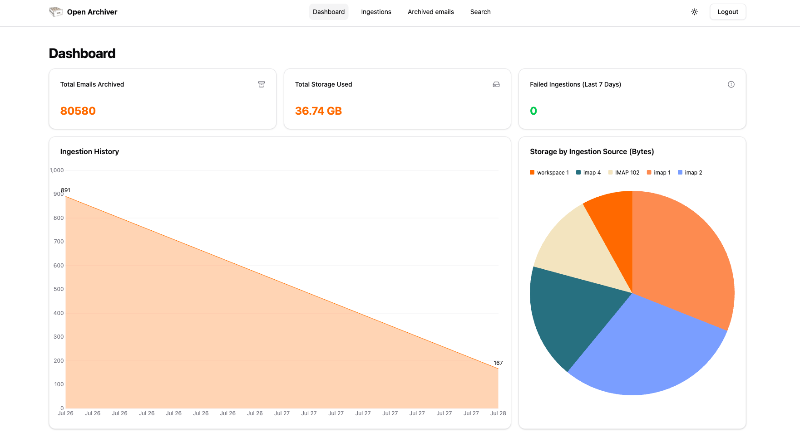
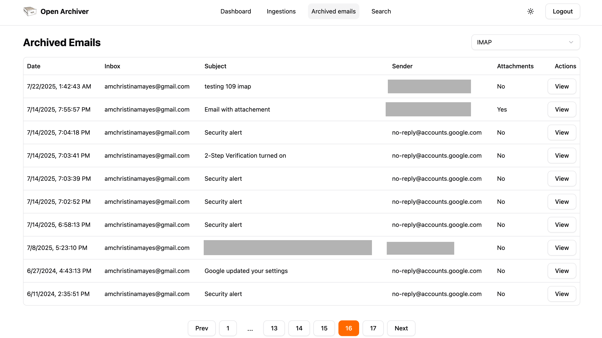
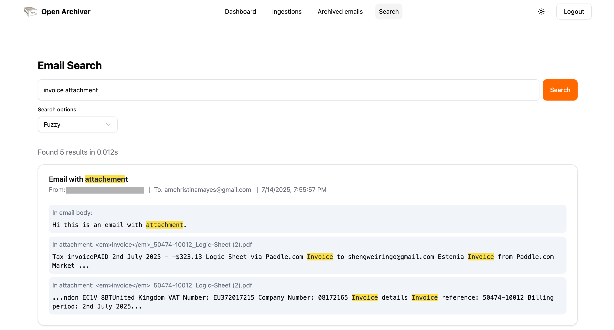

# Open Archiver

**A secure, sovereign, and affordable open-source platform for email archiving and eDiscovery.**

Open Archiver provides a robust, self-hosted solution for archiving, storing, indexing, and searching emails from major platforms, including Google Workspace (Gmail), Microsoft 365, as well as generic IMAP-enabled email inboxes. Use Open Archiver to keep a permanent, tamper-proof record of your communication history, free from vendor lock-in.

## Screenshots


_Dashboard_


_Archived emails_


_Full-text search across all your emails and attachments_

## Key Features

-   **Universal Ingestion**: Connect to Google Workspace, Microsoft 365, and standard IMAP servers to perform initial bulk imports and maintain continuous, real-time synchronization.
-   **Secure & Efficient Storage**: Emails are stored in the standard `.eml` format. The system uses deduplication and compression to minimize storage costs. All data is encrypted at rest.
-   **Pluggable Storage Backends**: Support both local filesystem storage and S3-compatible object storage (like AWS S3 or MinIO).
-   **Powerful Search & eDiscovery**: A high-performance search engine indexes the full text of emails and attachments (PDF, DOCX, etc.).
-   **Compliance & Retention**: Define granular retention policies to automatically manage the lifecycle of your data. Place legal holds on communications to prevent deletion during litigation (TBD).
-   **Comprehensive Auditing**: An immutable audit trail logs all system activities, ensuring you have a clear record of who accessed what and when (TBD).

## Tech Stack

Open Archiver is built on a modern, scalable, and maintainable technology stack:

-   **Frontend**: SvelteKit with Svelte 5
-   **Backend**: Node.js with Express.js & TypeScript
-   **Job Queue**: BullMQ on Redis for robust, asynchronous processing. (We use Valkey as the Redis service in the Docker Compose deployment mode, but you can use Redis as well.)
-   **Search Engine**: Meilisearch for blazingly fast and resource-efficient search
-   **Database**: PostgreSQL for metadata, user management, and audit logs
-   **Deployment**: Docker Compose deployment

## Deployment

### Prerequisites

-   [Docker](https://docs.docker.com/get-docker/) and [Docker Compose](https://docs.docker.com/compose/install/)
-   A server or local machine with at least 2GB of RAM.

### Installation

1.  **Clone the repository:**

    ```bash
    git clone https://github.com/LogicLabs-OU/OpenArchiver.git
    cd open-archiver
    ```

2.  **Configure your environment:**
    Copy the example environment file and customize it with your settings.

    ```bash
    cp .env.example .env
    ```

    You will need to edit the `.env` file to set your admin passwords, secret keys, and other essential configuration. Read the .env.example for how to set up.

3.  **Run the application:**

    ```bash
    docker compose up -d
    ```

    This command will pull the pre-built Docker images and start all the services (frontend, backend, database, etc.) in the background.

4.  **Access the application:**
    Once the services are running, you can access the Open Archiver web interface by navigating to `http://localhost:3000` in your web browser.

## Data Source Configuration

After deploying the application, you will need to configure one or more ingestion sources to begin archiving emails. Follow our detailed guides to connect to your email provider:

-   [Connecting to Google Workspace](docs/services/email-providers/google-workspace.md)
-   [Connecting to Microsoft 365](docs/services/email-providers/microsoft-365.md)
-   [Connecting to a Generic IMAP Server](docs/services/email-providers/imap.md)

## Contributing

We welcome contributions from the community!

-   **Reporting Bugs**: If you find a bug, please open an issue on our GitHub repository.
-   **Suggesting Enhancements**: Have an idea for a new feature? We'd love to hear it. Open an issue to start the discussion.
-   **Code Contributions**: If you'd like to contribute code, please fork the repository and submit a pull request.

Please read our `CONTRIBUTING.md` file for more details on our code of conduct and the process for submitting pull requests.
