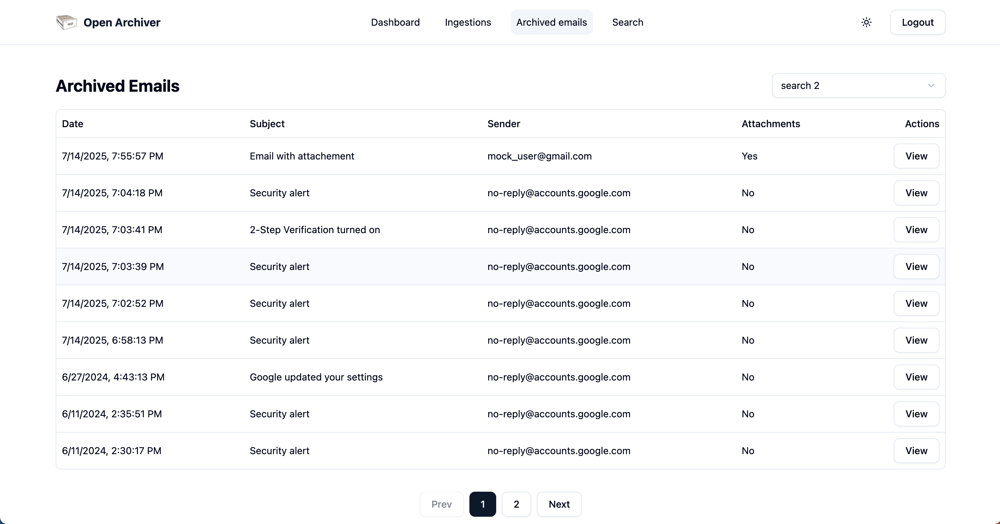

# Open Archiver

> [!WARNING]
> This project is currently in active development and has not yet reached a stable General Availability (GA) release. It is not recommended for use in production environments. We welcome contributions from the community to help us accelerate development and improve the platform. Please see our [Contributing](#contributing) section for more details.

**A secure, sovereign, and affordable open-source platform for email archiving and eDiscovery.**

Open Archiver enables individuals and organizations to take control of their digital communication history. It provides a robust, self-hosted solution for ingesting, storing, indexing, and searching emails from major platforms, ensuring a permanent, tamper-proof record of your most critical data, free from vendor lock-in.



## Vision

To provide individuals and organizations with a secure, sovereign, and affordable platform to preserve and access their digital communication history.

## Key Features

-   **Universal Ingestion**: Connect to Google Workspace, Microsoft 365, and standard IMAP servers to perform initial bulk imports and maintain continuous, real-time synchronization.
-   **Secure & Efficient Storage**: Emails are stored in the standard `.eml` format. The system uses deduplication and compression to minimize storage costs. All data is encrypted at rest.
-   **Pluggable Storage Backends**: Start with local filesystem storage and scale to S3-compatible object storage (like AWS S3 or MinIO) as your needs grow.
-   **Powerful Search & eDiscovery**: A high-performance search engine indexes the full text of emails and attachments (PDF, DOCX, etc.). The intuitive UI supports advanced search operators, filtering, and case management.
-   **Compliance & Retention**: Define granular retention policies to automatically manage the lifecycle of your data. Place legal holds on communications to prevent deletion during litigation.
-   **Comprehensive Auditing**: An immutable audit trail logs all system activities, ensuring you have a clear record of who accessed what and when.
-   **Role-Based Access Control (RBAC)**: Enforce the principle of least privilege with pre-defined roles for Administrators, Auditors, and End Users.

## Tech Stack

Open Archiver is built on a modern, scalable, and maintainable technology stack:

-   **Frontend**: SvelteKit with Svelte 5
-   **Backend**: Node.js with Express.js & TypeScript
-   **Job Queue**: BullMQ on Redis for robust, asynchronous processing
-   **Search Engine**: Meilisearch for blazingly fast and resource-efficient search
-   **Database**: PostgreSQL for metadata, user management, and audit logs
-   **Deployment**: Docker Compose for easy, one-command deployment

## Getting Started

### Prerequisites

-   [Docker](https://docs.docker.com/get-docker/) and [Docker Compose](https://docs.docker.com/compose/install/)
-   A server or local machine with at least 2GB of RAM.

### Installation

1.  **Clone the repository:**

    ```bash
    git clone https://github.com/LogicLabs-OU/OpenArchiver.git
    cd open-archiver
    ```

2.  **Configure your environment:**
    Copy the example environment file and customize it with your settings.

    ```bash
    cp .env.example .env
    ```

    You will need to edit the `.env` file to set your database passwords, secret keys, and other essential configuration.

3.  **Run the application:**

    ```bash
    docker compose up -d
    ```

    This command will build the necessary Docker images and start all the services (frontend, backend, database, etc.) in the background.

4.  **Access the application:**
    Once the services are running, you can access the Open Archiver web interface by navigating to `http://localhost:3000` in your web browser.

## Contributing

We welcome contributions from the community! Whether you're a developer, a designer, or just an enthusiast, there are many ways to get involved.

-   **Reporting Bugs**: If you find a bug, please open an issue on our GitHub repository.
-   **Suggesting Enhancements**: Have an idea for a new feature? We'd love to hear it. Open an issue to start the discussion.
-   **Code Contributions**: If you'd like to contribute code, please fork the repository and submit a pull request.

Please read our `CONTRIBUTING.md` file for more details on our code of conduct and the process for submitting pull requests.

## License

This project is licensed under the AGPL-3.0 License.
